# Summary
This is a Murano demo for the TI cc3200 board. This readme guide will explain how to build and run the demo.  

# Installation and Build Guide

## What you need to build

* Access to this source repository to clone (git term) or download to your computer.
* Setup TI Code Composer Studio v6.0 or later in your computer.[Link - http://www.ti.com/lit/ug/swru376d/swru376d.pdf]
* Setup TI Uniflash v4.0 or later in your computer.[Link - http://www.ti.com/tool/UNIFLASH?keyMatch=cc3200%20uniflash&tisearch=Search-EN-Everything]
* A valid Murna account (Sign up in www.exosite.com)

## GETTING STARTED

### CREATE A PRODUCT IN MURANO

In this section, you will create a new Product in Murano.

1. In Murano, navigate to the Products tab
2. To add a Product, click "NEW PRODUCT."

3.In the New Product popup:
	a.Enter a name for the Product in the Name field.
	b.Select Start from scratch in the Choose starting point drop-down menu.
	c.Copy and paste the following URL into the Link to your product template field:https://raw.githubusercontent.com/exosite-garage/arduino_exosite_library/master/examples/Murano-SmartLightBulb-ThingDevBoard/product_spec_smart_lightbulb_example.yaml
		This will allow you to use a product template spec file to set up the product definition.
	d.Click "ADD."
	

4.Once the Product has been created, navigate to the DEFINITION tab.

These are the resources your device will interact with. They were created automatically from the product template you selected in the previous step. In this example, the device will generally write data to the temperature, humidity, and uptime aliases, while watching the state alias for changes.

NOTE: If you did not use the template URL in the previous step, you can manually configure your product definition. From the DEFINITION tab, configure your dataport resources as specified below. Also, set the default value for state to 0 so the device has a default value it reads to know to turn the LED on or off. Click on the state resource in the DEFINITION tab and write a 0 to the value.

* alias: _temperature_, format: _float_
* alias: _humidity_, format: _float_
* alias: _uptime_, format: _integer_
* alias: _state_, format: _integer_

### FLASH AND RUN THE EXAMPLE APPLICATION

In this section, you will flash and run an example application for a connected lightbulb in CC3200-LAUNCHXL.

1. Open CCS, import 3200ExositeDemo project (The source code you have download from github), in project explore, you shall see 5 projects, if not, setup environment refer to here: [Link - http://www.ti.com/lit/ug/swru376d/swru376d.pdf]	
	
	
2. Click on "3200ExositeDemo", open main.c , enter Product ID.	
	
	
#### Find your product ID:
		a. In Murano, navigate to the Products tab and select the product you just created.
		
		b. On the INFO tab, locate the Product ID and copy it.			

	
3. Build all
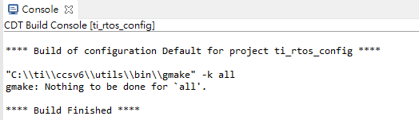

4. Short SOP1, connect 3200-LAUNCHXL board with usb cable
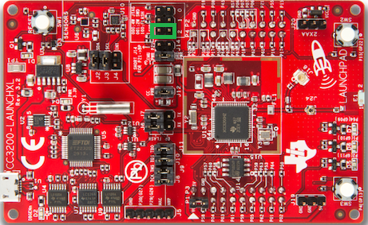

5. Open TI UniFlash, and open configuration.Load "ExositeReadyDemo.usf"
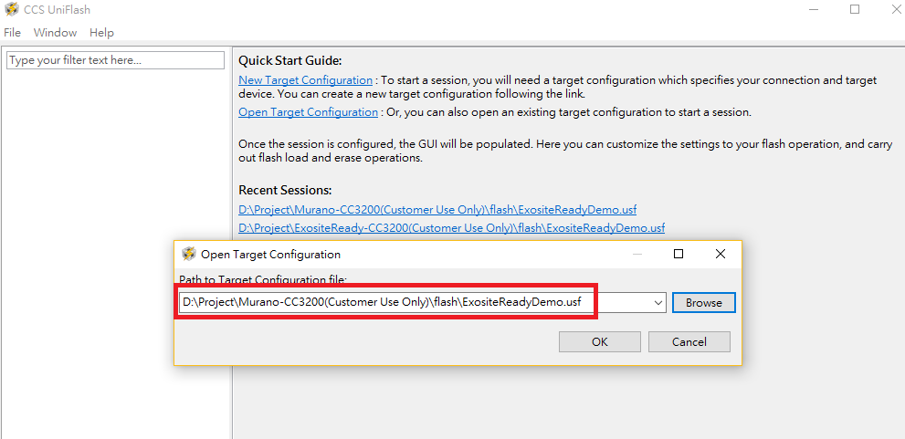

6.Setup the com port which is connect with your board. If you don't know the port number, you may refer to page 6 of this link : http://www.ti.com/lit/ug/swru376d/swru376d.pdf

7.Click on "Format", and then "Program". Close "UniFlash"

8. Disconnect USB cable, remove SOP1 jumper, and add jumper to P58-VCC, which will setup the board in AP mode. Plug in the USB cable again.
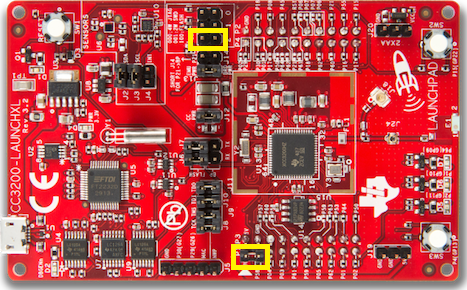

9. Open "Tera Term", You can download the tera-term here:http://download.cnet.com/Tera-Term/3000-20432_4-75766675.html

10. Select "Setup"->"Serial Port" , set the com port which is connect your cc3200 board, baudrate as 115200.
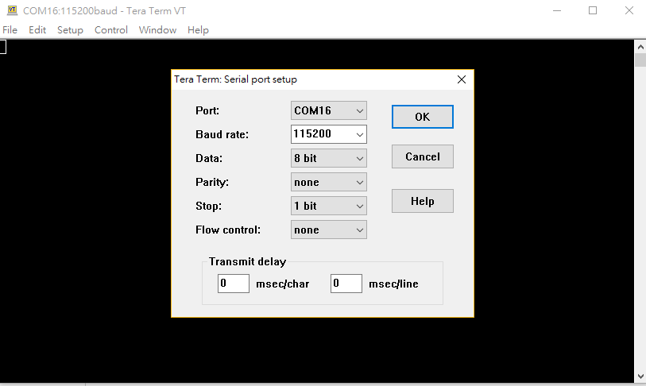

11. Click "RESET" button on cc3200 board. The Tera Term will show the board status.
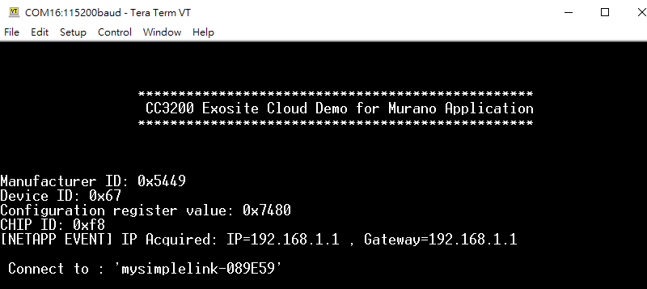

12. Connect the AP router named "mysimplelink-xxxx", and open a browser with 192.168.1.1 (CC3200 board is acting like an AP router), click on "ABOUT" tab, copy the MAC Address.

13. setup the local AP ssid and password in "SETUP" tab. Click "Add" to finish the setting.
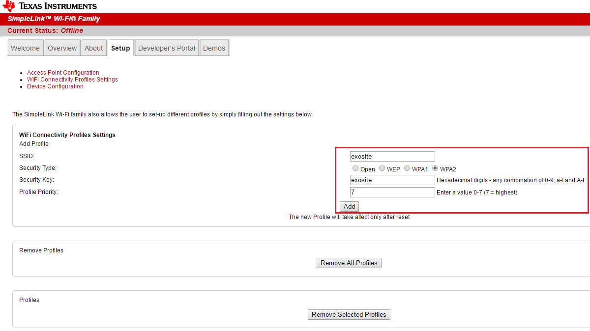

14. The local AP router information has been saved to the board.
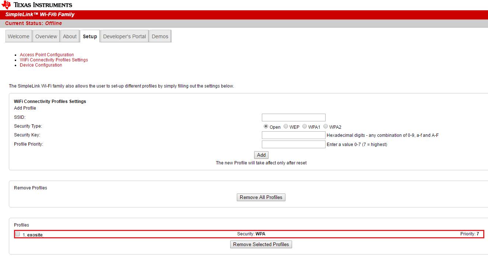

15. Back to the TeraTerm, at the same time, push the "RESET" button on the board, and remove the p58-vcc jumper, device shall start to upload data to cloud
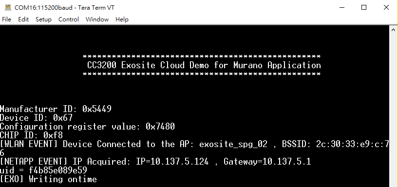

### ADD A DEVICE IN MURANO
In this section, you will create a device under your Product in Murano.

1. In Murano, navigate to the Products tab and select the product you just created.

2. Navigate to the DEVICES tab and click "New Device."
	
	
3.In the New Device popup:
	a. Enter a name for the device in the Name field. This will only be used to help you distinguish between devices.
	b. Enter the device identifier (MAC address) you identified in the previous section in the Identity field.
	c. Click "CREATE."
		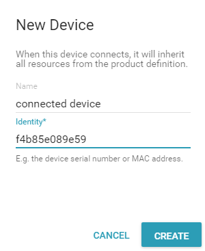

4. Back to the TeraTerm, at the same time, push the "RESET" button on the board, and remove the p58-vcc jumper, device shall start to upload data to cloud.		
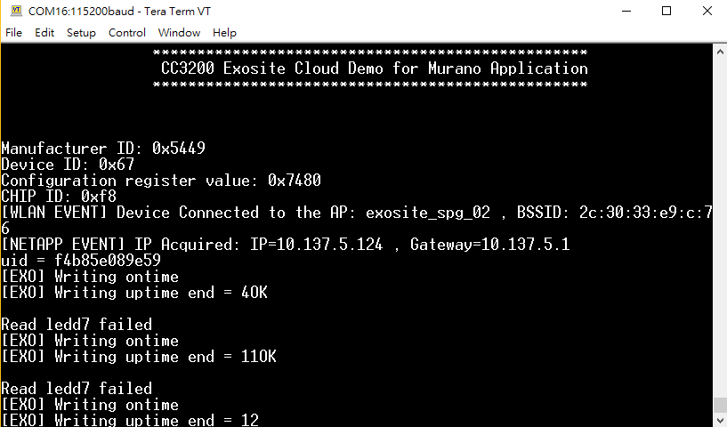

5. In Murano, navigate to the DEVICES tab for this Product, select your device, and ensure data is showing up on the RESOURCES tab.
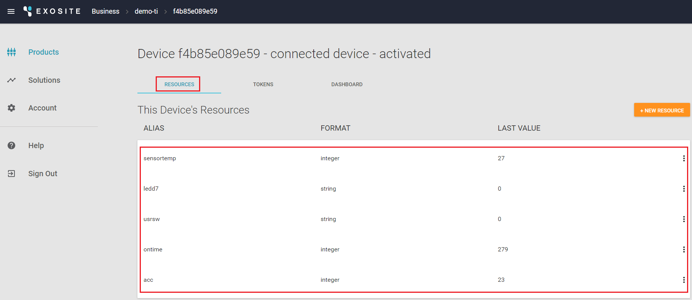

### CREATE A DASHBOARD IN MURANO
In this section, you will create a dashboard to view the data from the connected lightbulb and turn it on and off remotely.

1. From the RESOURCES tab for your device, open the DASHBOARD tab.
