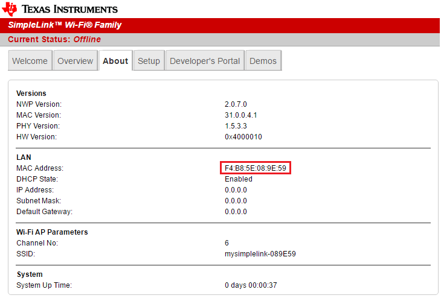
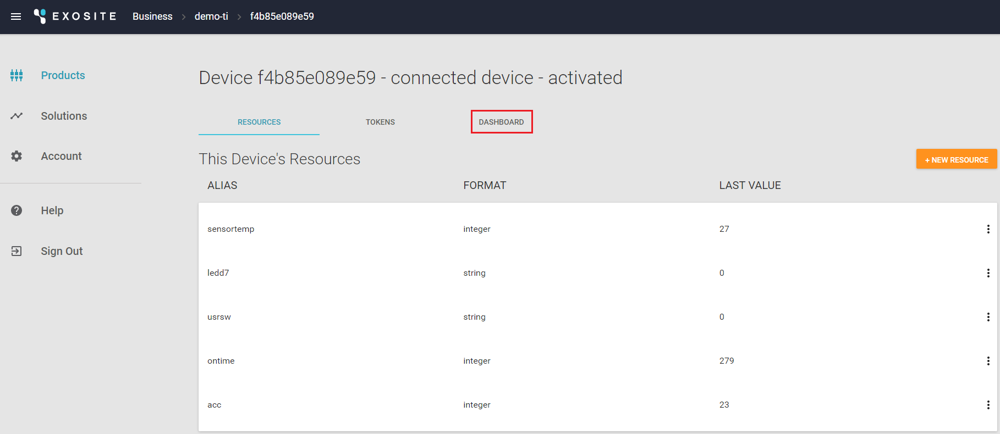
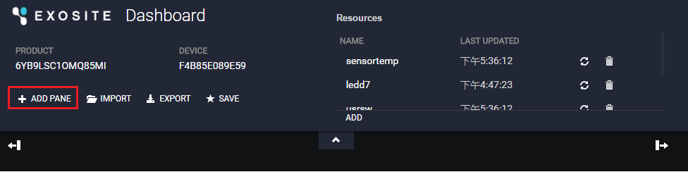
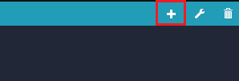
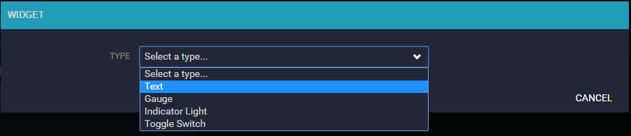
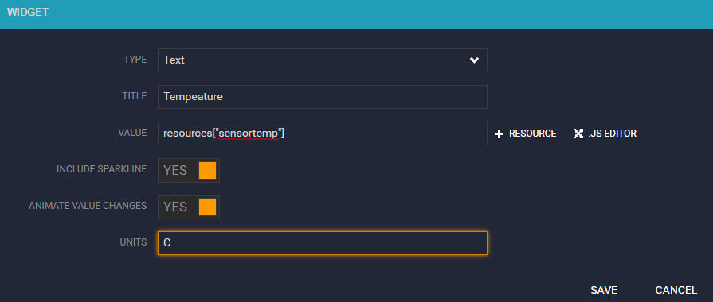
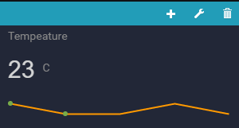

#Summary
This is a Murano demo for the TI cc3200 board. This readme guide will explain how to build and run the demo.

# What you need to build

* Access to this source repository to clone (git term) or download to your computer.
* Setup TI Code Composer Studio v6.0 or later in your computer. Reference Link - [CC3200 Getting Start Guide](assets/swru376d.pdf)
* Setup TI Uniflash v4.0 or later in your computer. Download Link - [UniFlash](http://www.ti.com/tool/UNIFLASH?keyMatch=cc3200%20uniflash&tisearch=Search-EN-Everything)
* Download Tera Term. Download Link - [Tera Term](http://download.cnet.com/Tera-Term/3000-20432_4-75766675.html)
* A valid Murna account (Sign up in <http://www.exosite.com>)

#Getting start

##Create a Product in Murano
In this section, you will create a new Product in Murano.  

1. Login your account in <http://www.exosite.com>
2. Navigate to the Products tab.
3. To add a Product, click `+NEW PRODUCT`

4. In the **New Product** popup:  

	a. Enter a name for the Product in the Name field.  
    
	b. Select Start from scratch in the Choose starting point drop-down menu.  
    
	c. Copy and paste the following URL into the **Link to your product template** field.  
    
	***https://raw.githubusercontent.com/Lioson/TI-CC3200-For-Murano/master/CC3200_Product_Spec_For_Murano.yaml***
	
    ***This will allow you to use a product template spec file to set up the product definition.***  
    
	d. Click "ADD."  
    
	

5. Once the Product has been created, navigate to the `DEFINITION` tab.
	These are the resources your device will interact with. They were created automatically from the product template you selected in the previous step. In this example, the device will generally write data to the temperature, humidity, and uptime aliases, while watching the state alias for changes.

***NOTE: Current template URL is not avaliable, you can manually configure your product definition. From the `DEFINITION` tab, configure your dataport resources as specified below. Also, set the default value for state to 0 so the device has a default value it reads to know to turn the LED on or off. Click on the state resource in the DEFINITION tab and write a 0 to the value.***  

	* alias: _ontime_, format: _integer_
	* alias: _ledd7_, format: _string_
	* alias: _sensortemp_, format: _integer_
	* alias: _acc_, format: _integer_
	* alias: _usrsw_, format: _string_

## Flash and run the example application

In this section, you will flash and run an example application for a connected lightbulb in CC3200-LAUNCHXL.

1. Open CCS, import 3200ExositeDemo project (The source code you have download from github), in project explore, you shall see 5 projects, if not, setup environment refer to [TI Doc](http://www.ti.com/lit/ug/swru376d/swru376d.pdf)  
	
	
2. Click on **3200ExositeDemo**, open main.c and enter Product ID.	
	
	
    **Find your product ID:**  
    
	a. In Murano, navigate to the `Products` tab and select the product you just created.  
    
	b. On the `INFO` tab, locate the Product ID and copy it.   
	
	
3. Build all.  
	

4. Short SOP1, connect 3200-LAUNCHXL board with usb cable.  
	

5. Open TI UniFlash, and open configuration.Load "ExositeReadyDemo.usf".  
	

6. Setup the com port which is connect with 3200-LAUNCHXL board. Refer to [CC3200 Getting Start Guide](assets/swru376d.pdf) page 6 for setup com port.  

7. Click on `Format` tab, after device has been formatted, click on 'Program' tab.When program has done, close **UniFlash**.  

8. Disconnect USB cable, remove SOP1 jumper, and add jumper to P58-VCC, which will setup the board in AP mode. Plug in the USB cable again.  

9. Open **Tera Term**.  

10. Select `Setup`->`Serial Port` , set the com port which is connected your 3200-LAUNCHXL board, setup baudrate as 115200.  

11. Click "RESET" button on 3200-LAUNCHXL board. The Tera Term will show the board status.  

12. Connect the AP router named "mysimplelink-xxxxxx", and open a browser with http://192.168.1.1 (CC3200 board is acting like an AP router), click on `ABOUT` tab, copy the MAC Address.  

13. setup the local AP **SSID**,**Security Type**, **Security Key** and **Profile Priority** in `SETUP` tab. Click "Add" to finish the setting.  

14. The local AP router information has been saved to the board.  

15. Back to the Tera Term, at the same time, push and hold the "RESET" button on 3200-LAUNCHXL board, remove the p58-vcc jumper, release "RESET" button, observe Tera Term terminal, device start to upload data to cloud.  
  
***Note: Device will hold the upload sequence until the device's MAC address has been inputed into Murano.***  

## Add a device in Murano
In this section, you will create a device under your Product in Murano.  

1. In Murano, navigate to the `Products` tab and select the product you just created.  

2. Navigate to the `DEVICES` tab and click `+New Device`.  

	
3. In the New Device popup:
	a. Enter a name for the device in the Name field. This will only be used to help you distinguish between devices.
	b. Enter the device identifier (MAC address) you identified in the previous section in the Identity field.
	c. Click `CREATE`.
	

4. Back to the Tera Term, push the "RESET" button on the board, device start to report data to cloud .		

5. In Murano, navigate to the `DEVICES` tab for this Product, select your device, and ensure data is showing up on the `RESOURCES` tab.  

## Create a dashoboard in Murano
In this section, you will create a dashboard to view the tempeature chart.  

1. Click on the `DASHBOARD` tab.  

2. A new browzer will popup and show the dashboard, click on`+ADD PANE`.  

3. Click on `+`.  

4. In the "TYPE", select Text.  

5. Input "TITLE",click on `+RESOURCE`,and select "sensor temp". Place 'F' for "UNITS", and click `SAVE`.  

6. A tempeature chart is showed.  

